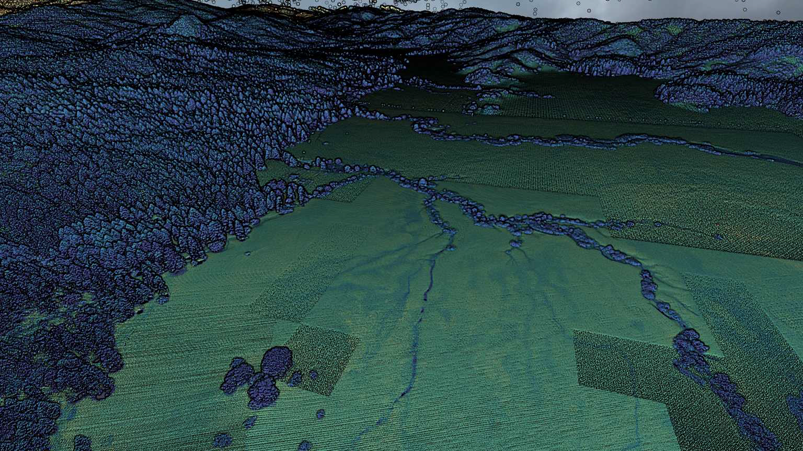
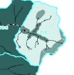
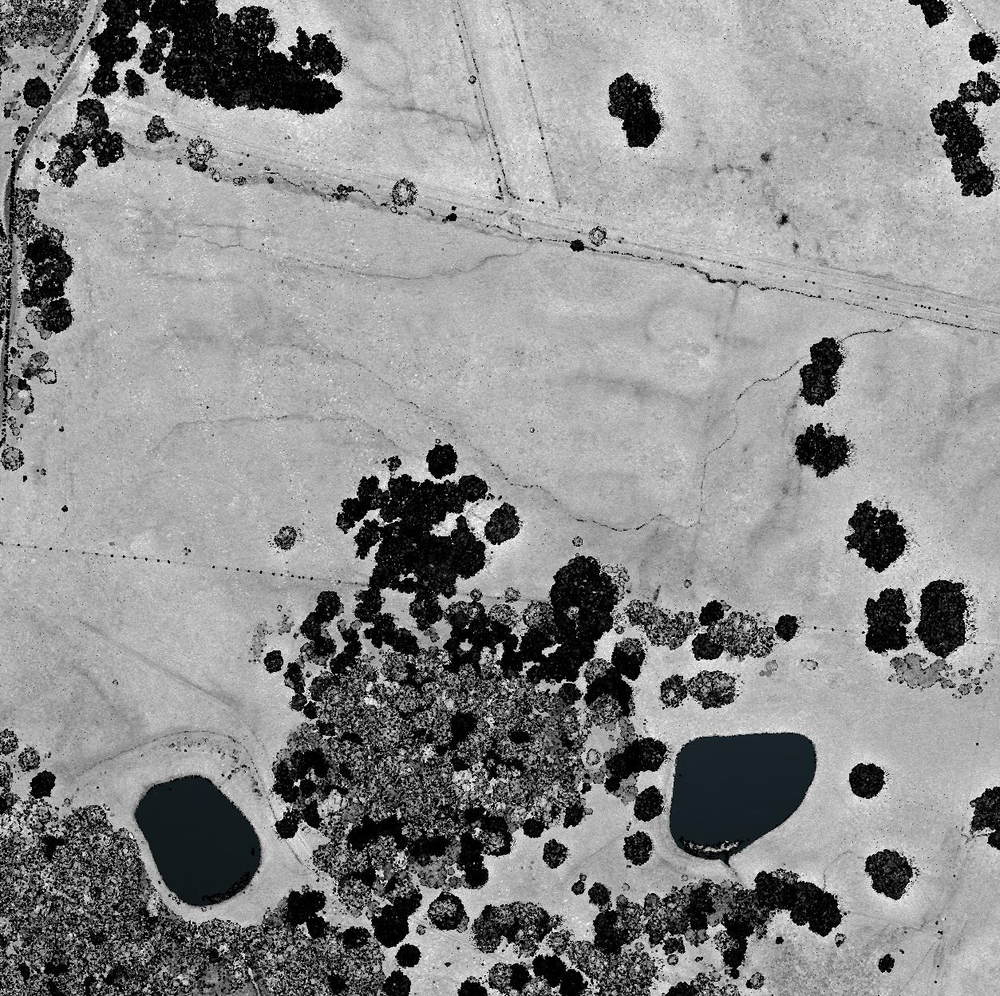
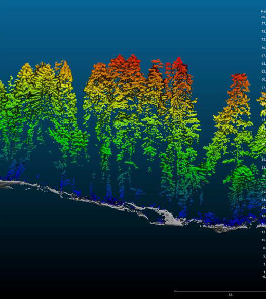
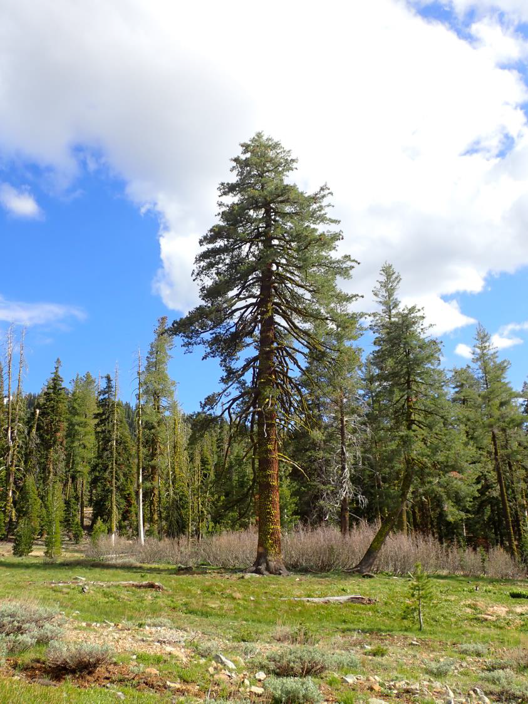
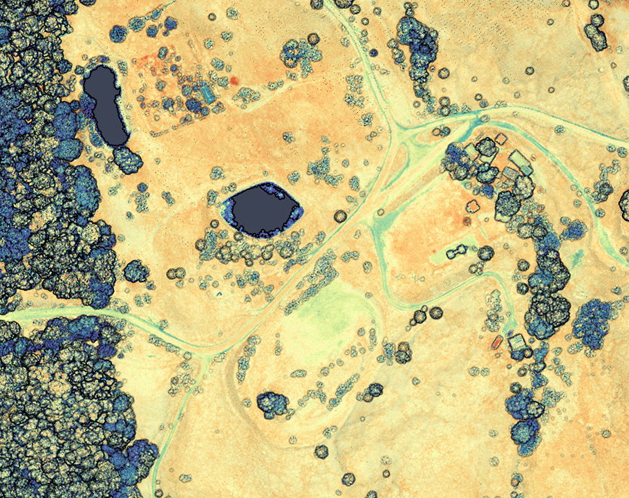
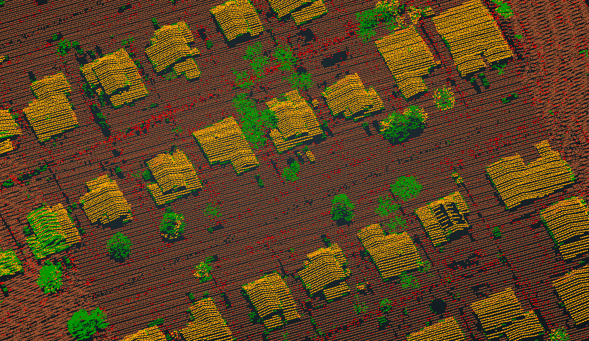
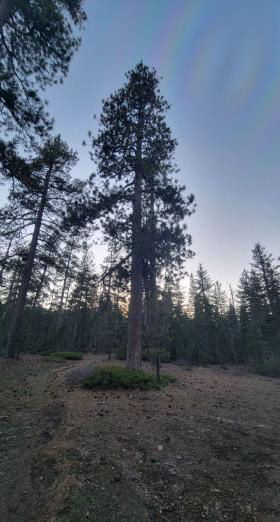
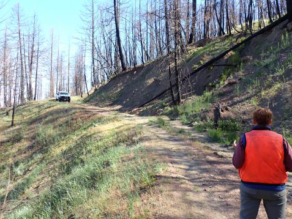

# Salmon Creek Systems

## You cannot manage what you cannot measure
Salmon Creek Systems is a public benefit consulting firm committed to supporting communities achieving science based climate resilience and mitigation targets.  SCS supports community resilience by deploying an agile federation of mission critical environmental data strategies.  SCS is committed to balancing the rapidly growing capabilities of centralized geospatial data providers with locally evolving knowledge and practices to enhance critical environmental decision support functions. 

## Principles 

* Right to repair, spatial data infrastructure
* Natural resource decision support tools are mission critical cultural resources
* Every effort should be made to facilitate long term data stewardship
* Spatial Data Infrastructure assets should be developed using emerging best practices for metadata, documentation, and reproducibility to preserve long term value by future users.  
* We provide tools for land stewardship 
* Current land tenure practices are evolving to adapt to emerging
* Historical conservation strategies have both as well as more complicated historical ramifications.    
* We are committed to knowledge co production with land managers and support diverse engagement in natural resource issues.   
 
## Projects
### Stewardship Atlases
The Stewardship Atlases ("SA") are scheduled subscription data  builds integrated to provide comprehensive situational awareness of environmental conditions. SA’s are structured data products built using cloud native geospatial assets, agency datasets, and locally tasked content. Stewardship Atlases have been developed for a series of user story archetypes and are then are localized through iterative knowledge co production with land managers. The local data produced through the Stewardship Atlases have the ability to contribute to regional knowledge, calibrate remotely sensed and imputed datasets, and adapt to emerging concerns.  

## User story archetypes 
* Incident Resource Advisors
* Strategic Fire Plans
* Subregional prefire planners 
* Small acreage forest planning
* Landscape risk management 
* Post fire planning.
* Prescribed fire planning 

Contact: tim   “at”  caflc.dev

