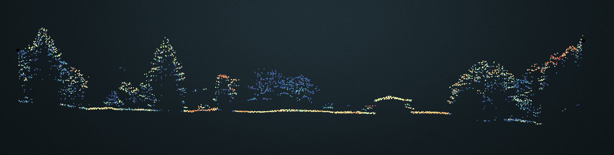
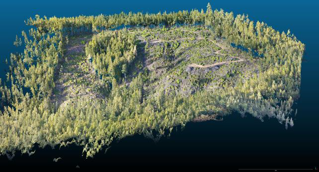

# Salmon Creek Systems

## You cannot manage what you cannot measure
Salmon Creek Systems LLC is a public benefit consulting firm committed to supporting communities pursuing science based climate resilience and mitigation targets.  SCS supports community resilience through agile federation of environmental data systems.  SCS is committed to balancing the rapidly growing capabilities of centralized geospatial data providers with local knowledge and practices.  
# Strategy and Philosophy

* Amplify community knowledge coproduction and participatory development
* Facilitate knowledge flows across a network
* Deploy leading data stewardship practices
* Elevate SNAIL data methods, Slow, Narrow, Accurate, Indepth, Local knowledge systems

## Data Informed Democratic Decision Support Systems 
Facilitate broad inclusive access and informed engagement with the environmental data infrastructure 
Geospatial data underpins climate resilience efforts 

## Building data services that support decision across the environmental management lifecycle 
* Microservices    small data is beautiful.  Granular metadata 
* Provide data authoring tools to the widest possible community
* Maintain long terminteroperability thorugh use of open standards

# Tools and Technology
** Stewardship Atlas Platform
SCS develops and hosts a platform for implementing the above goals using Open Source interoperable tools.

A Stewardship Atlas is a data set; a configuration for storing, processing, and sharing that data set; and a set of implementions for doing so.

More concretely it is a set of maps and documents tied to specific types of planning and implemention in a specific geographic area. Examples might include:
* Wildfire Planning and Response in a specific community
* Prioritization of projects and funding with geographic aspects - natural resource organizations, advocacy groups, etc
* Grantwriters needing to gather geospatial data and maps for proposals
* researchers and practitioners looking to work across different platforms, data formats, and toolchains in a consistent low-frction way.

For more about the philosopy and design principles behind it see our [vision.markdown](Vision Statement) and for more low level technical detail see our [atals_architecture.markdown](Architectural OVerview) and [index.html](Code Documentation).

# About Salmon Creek Systems LLC
SCS is a consulting firm specializing in developing tools that empower community climate resilience planning and implementation.  Tim Bailey has several decades of experience in natural resource geospatial analysis with experience in forestry, hydrology, and soils. He has been an early adopter of lidar, photogrammetry, and cloud native geospatial technologies.  Since 2016 he has served in a number of roles facilitating community climate hazard mitigation and resilience efforts across Northern California. Scot Kennedy has built data products for decades using scalable cloud native data processing pipelines and data science. Beyond the core engineering this has meant working to translate customer and community needs into actionable and accessible data across fields including security, biotechnology, and product design. SCS bridges his work in academia and the tech sector with his lifelong relationship to the land he grew up on in Northern California. 

Contact: tim   “at”  caflc.dev or gateless "at" gmail.com
